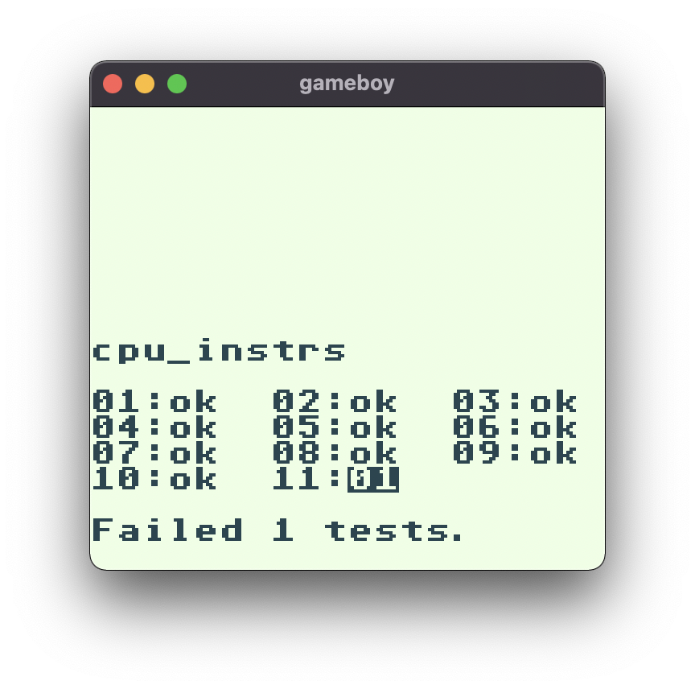

# Gameboy

<div align="center">


#### DMG & GameBoy Color emulator

</div>

## Screenshots
| Menu                                              | In-Game                                                 |
|---------------------------------------------------|---------------------------------------------------------|
|  |  |
|        |        |
|          |          |
|      |      |

## Cloning
```sh
$ git clone --recursive https://github.com/coolq1000/gameboy.git
```

## Building
Dependencies: C/C++, CMake
```sh
$ cmake -B build -G "Unix Makefiles"
$ cd build && make
```

## Usage
```sh
$ ./gameboy <rom_path>
```

## Blargg's Test Report


| Col 1  | Col 2  | Col 3  |
|--------|--------|--------|
| 01: ok | 02: ok | 03: ok |
| 04: ok | 05: ok | 06: ok |
| 07: ok | 08: ok | 09: ok |
| 10: ok | 11: 01 |        |

## Problems

### CPU - Processor
Currently, the emulator fails test #11 on `cpu_instrs.gb`.

### PPU - Graphics
There are some visual glitches/flickering on some sprites due to inaccurate frame timing.

### APU - Audio
The APU has been implemented fairly inaccurately, and causes some pops/crackles in some games. It works for the most part.
